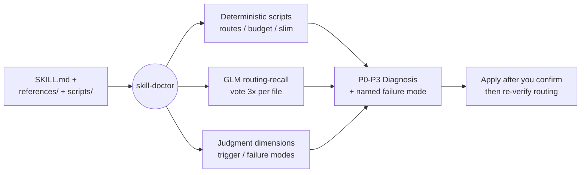

English | [简体中文](README.zh-CN.md)

<div align="center">

# skill-doctor

<p align="center">
  
</p>

> *"A skill the model never triggers is just dead documentation."*

[](LICENSE)
[]()
[]()
[]()

<br>

**Diagnose, routing-test, and restructure your agent skills — so the model actually triggers them.**

<br>

skill-doctor audits a `SKILL.md` the way an LLM actually reads it. Spec linters stop at frontmatter and broken links. skill-doctor scores how reliably a skill triggers, runs a routing-recall test on every reference file, names the failure mode, and rewrites the package layout when the routing breaks. Four deterministic scripts carry the core checks, and none of them needs an API key.

<br>

[See It in Action](#see-it-in-action) · [Up and Running](#up-and-running) · [By the Numbers](#by-the-numbers) · [How It Works](#how-it-works)

</div>

---

## See It in Action

Point it at a skill and it prints a diagnosis, not a grammar report:

```text
[skill-doctor] Auditing: my-skill/SKILL.md   body=142 lines   description=64 chars
[skill-doctor] Budget: 38 skills installed, descriptions 31k vs ≈40k → fits

[skill-doctor] Diagnosis

❌ Must fix (P0→P3)
  [P0 effect break]    Step 3 reads a file Step 1 never writes → the workflow dead-ends
  [P1 trigger]         description has no negative constraint → trigger rate ~50%, not ~100%
  [weak-leading-word]  body opens with "This skill helps you..." → a no-op line the model skips

⚠️ Suggested
  - references/tips.md mixes 3 unrelated topics → split by topic, one file each

✅ Passed
  - routing: 2 hops, 0 orphans, 0 dangling links
  - 17 references reachable from SKILL.md
```

It does not check your Markdown grammar. It tells you the model will silently skip Step 3, and that your description fires about half the time, then says exactly why.

---

## Up and Running

A skill installs by living in your skills folder:

```bash
git clone https://github.com/Zane456/skill-doctor.git ~/.claude/skills/skill-doctor
```

The four scripts run on Python 3 with zero dependencies. The core checks — routing, budget, structure — need nothing else. One optional check, the GLM routing-recall test, calls an LLM, so it reads a key from the environment:

```bash
export GLM_API_KEY=your_zai_key   # optional, only for the routing-recall test
```

Then, inside Claude Code or Codex, ask it to review a skill — *"audit this SKILL.md"* / *"审查这个 skill"* — or invoke `skill-doctor` directly.

---

## By the Numbers

Every claim below traces to a script or a reference file in this repo.

| Feature | What you get |
| :--- | :--- |
| **Deterministic scripts** | 4 checks — routing, listing-budget, structure, description-slim — no LLM, exit codes you can wire into CI |
| **Trigger template** | The Seleznov 3-part description form lifts trigger rate from ~50% to ~100% (650-trial study) |
| **Routing-recall test** | GLM votes 3× per reference file; a majority decides whether each doc is uniquely findable |
| **Failure-mode taxonomy** | 6 named modes — `no-op` / `sediment` / `premature-completion` / `sprawl` / `weak-leading-word` / `duplication` |
| **Structure surgery** | Enforces a hard 2-hop routing cap, splits files verbatim, leaves 0 orphans |
| **Listing-budget guard** | Measures all installed descriptions against the ~1% context budget — **Claude Code only** (see note) |
| **Compass cap** | SKILL.md ≤ 6000 chars; this skill's own 17 references load on demand |

> **Note — the listing-budget check is Claude Code only.** It relies on Claude Code's shared skill-listing budget (≈1% of the model's context window; on overflow CC silently drops descriptions to name-only, and a name-only skill cannot auto-trigger). Codex has no equivalent budget mechanism, so this one check is skipped there. The other three scripts and every judgment dimension are cross-agent.

---

## How It Works

skill-doctor runs a fixed diagnosis flow, and every step prints a line — a step with no visible output is a step the model silently skips.



**1. Read and budget** — reads the whole SKILL.md, then counts every installed description against the listing budget, so it judges one skill knowing the crowd it competes with.
**2. Load only what fires** — pulls in a quality dimension only when its `when-to-read` line matches, the same lazy-loading it asks of the skills it audits.
**3. Dry-run one real prompt** — walks a typical prompt through the body steps; if Step 3 needs an input no earlier step produced, that is a P0 effect break.
**4. Report, then name it** — prints a P0–P3 list and tags each finding with its failure mode, so "written badly" becomes "this line is a no-op."
**5. Fix and re-verify** — after you confirm, it applies the edit and re-runs `check_routes.py`; a restructure is never called done while routing still fails.

---

## What's Inside

```
skill-doctor/
├── SKILL.md                   # the compass — 5988 chars, points to everything else
├── references/                # 17 on-demand dimensions
│   ├── description-templates.md   # the Seleznov trigger template
│   ├── structure-surgery.md       # split / merge / index, 2-hop cap
│   ├── predictability-glossary.md # the named failure modes
│   └── …
└── scripts/                   # 4 deterministic checks, no dependencies
    ├── check_routes.py            # reachability, orphans, 6000-char cap
    ├── check_listing_budget.py    # description budget (Claude Code)
    ├── eval_retrieval.py          # GLM routing-recall vote
    └── check_desc_slim.py         # safe description-slimming gate
```

MIT — use it, fork it, ship it.

---

<div align="center">

> *A skill the model never triggers is just dead documentation.*

<br>

⭐ If skill-doctor caught a dead step in one of your skills, give it a star.

<br>

**Zane456** — author of [clear-chinese](https://github.com/Zane456/clear-chinese)

| Platform | Link |
| :--- | :--- |
| 🐙 GitHub | [@Zane456](https://github.com/Zane456) |

<br>

MIT License © [Zane456](https://github.com/Zane456)

</div>
