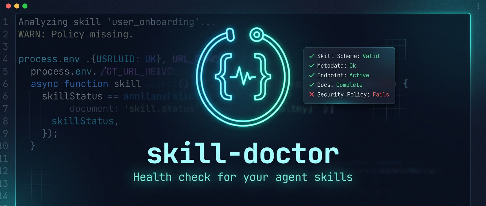

[English](README.md) | 简体中文

<div align="center">

# skill-doctor



**给 skill 一个优质的结构。**

[](LICENSE)
[]()
[]()

</div>

---

## 特点

- 审查 skill 文档是否符合规范,判断哪些文件需要拆分
- 参考 LLM Wiki 式索引,验证每个文件都能被路由检索到
- 每条规则都援引 Anthropic 官方定义与最佳实践背书
- 验证 skill 放进全局环境后能否被正常识别、调用

---

## 介绍

skill-doctor 是一个审查你写的 skill 的 skill。你写好一个 skill,却没法确定模型会不会在该用时调用它、会不会读完正文、能不能找到对的参考文件。这些问题平时不报错,你根本发现不了。skill-doctor 把它们一项项查出来,按严重程度排好,告诉你每个问题为什么是问题、该怎么改;你点头之后它才动手。它只重整结构,不动功能:把 skill 调成更规范的组织方式,该触发能触发、该读到的能读到,但 skill 本身做什么、怎么做,一个字都不改。它写给所有自己做 skill 的人。

---

## 展示

```
你:帮我检查一下这个 skill

skill-doctor:

检查完成,3 个问题:

1. description 写了 1100 字,太长
   → 这段每次都被固定塞进上下文、占预算,砍到几百字内就够

2. SKILL.md 正文 680 行,超了
   → 一部分细节挪进 references/ 按需加载,不用每次全读进来

3. references 里有个文件谁都不会读到(孤儿)
   → 要么挂上路由,要么删

要我动手改吗?(确认前不碰你的文件)
```

---

## 仓库结构

```text
skill-doctor/
├── SKILL.md                          # 指南针:诊断流程 + 路由
├── GETTING_STARTED.md                # 一次性的 agent 引导安装(装完可删)
├── references/                       # 判断维度,按需加载
│   ├── index.md                      # 按 when-to-read 路由到每个维度
│   ├── apply-safety.md               # 改动前的尺寸闸、删除前检查、收尾闭环
│   ├── assets-vs-references.md       # 区分模板素材与参考文档
│   ├── body-quality-checklist.md     # 正文长度,以及哪些该下沉进 references
│   ├── description-templates.md      # 触发强度模板 + 描述预算算法
│   ├── effect-dry-run.md             # 拿一个真实 prompt 走一遍流程
│   ├── exception-fallback.md         # 路径或脚本出错时怎么办
│   ├── hard-code-vs-llm-judgment.md  # 哪些写成脚本,哪些交给模型判断
│   ├── hard-rules.md                 # 量化的必过硬规则
│   ├── language-policy.md            # 默认英文及其例外
│   ├── live-injection-check.md       # 这次会话里描述到底有没有被注入
│   ├── output-style.md               # skill-doctor 怎么跟人说话
│   ├── predictability-glossary.md    # 失效模式词汇表
│   ├── priority-tiers.md             # P0–P3 定义与归类
│   ├── rationale.md                  # 这个 skill 为什么存在
│   ├── structure-surgery.md          # 拆分、路由层级、2 跳上限
│   ├── visible-output-rule.md        # 每个流程步骤都必须有可见输出
│   └── yaml-pitfalls.md              # frontmatter 格式陷阱
├── scripts/                          # 确定性检查,不用 LLM(eval_retrieval 除外)
│   ├── detect_platform.py            # 识别平台及其描述预算规则
│   ├── check_routes.py               # 可达性 / 孤儿 / 断链 / 指南针上限
│   ├── check_listing_budget.py       # 跨平台描述预算
│   ├── check_desc_slim.py            # 缩短描述的安全闸
│   └── eval_retrieval.py             # 可选的 LLM 路由召回投票(自带 key)
├── assets/
│   └── hero.png                      # README 顶图
├── LICENSE                           # MIT
├── README.md                         # 英文版
└── README.zh-CN.md                   # 本文件(中文)
```

---

## 安装

**最简单——让 agent 自己装。** 把仓库 clone 下来,在你的 agent(Claude Code / Codex / Hermes / OpenClaw)里打开,说一句*"安装一下 skill-doctor"*。它会认出平台、装进对的 skills 目录,装完你可以删掉 `GETTING_STARTED.md`。

**手动装** — skill 装在哪,就是把它放进你的 skills 目录:

```bash
git clone https://github.com/Zane456/skill-doctor.git ~/.claude/skills/skill-doctor
# Codex / OpenClaw: ~/.agents/skills/skill-doctor    Hermes: ~/.hermes/skills/skill-doctor
```

脚本跑在 Python 3 上,零依赖,核心检查不要 API key。想开那个可选的、更深的 AI 检查,设三个环境变量接任意 OpenAI 兼容的服务(自带 key):

```bash
export EVAL_LLM_BASE_URL=https://api.deepseek.com
export EVAL_LLM_MODEL=deepseek-v4-flash
export EVAL_LLM_API_KEY=sk-...
```

<div align="center">

MIT License © [Zane456](https://github.com/Zane456)

</div>
