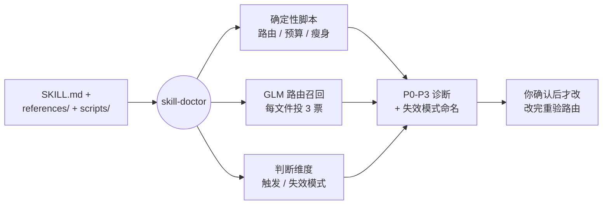

[English](README.md) | 简体中文

<div align="center">

# skill-doctor

<p align="center">
  
</p>

> *「触发不了的 skill，只是没人读的文档。」*

[](LICENSE)
[]()
[]()
[]()

<br>

**给 AI agent 的 skill 做体检：诊断、路由测试、重构包结构 —— 让模型真的会触发它。**

<br>

skill-doctor 按 LLM 真正读 skill 的方式来查 SKILL.md。普通 linter 只看 frontmatter 和死链。skill-doctor 评估这个 skill 触发得可不可靠、给每个 reference 文件跑路由召回测试、给毛病命名、路由断了就重构包结构。四个确定性脚本扛起核心检查，一个都不用 API key。

<br>

[看效果](#看效果) · [装上就能跑](#装上就能跑) · [用数字说话](#用数字说话) · [工作原理](#工作原理)

</div>

---

## 看效果

指向一个 skill，它给的是诊断，不是语法报告：

```text
[skill-doctor] Auditing: my-skill/SKILL.md   body=142 lines   description=64 chars
[skill-doctor] Budget: 38 skills installed, descriptions 31k vs ≈40k → fits

[skill-doctor] Diagnosis

❌ Must fix (P0→P3)
  [P0 effect break]    Step 3 reads a file Step 1 never writes → the workflow dead-ends
  [P1 trigger]         description has no negative constraint → trigger rate ~50%, not ~100%
  [weak-leading-word]  body opens with "This skill helps you..." → a no-op line the model skips

⚠️ Suggested
  - references/tips.md mixes 3 unrelated topics → split by topic, one file each

✅ Passed
  - routing: 2 hops, 0 orphans, 0 dangling links
  - 17 references reachable from SKILL.md
```

它不查 Markdown 语法。它告诉你：模型会偷偷跳过第 3 步，你的 description 只有一半概率触发 —— 然后说清为什么。

---

## 装上就能跑

skill 的安装 = 放进你的 skills 文件夹：

```bash
git clone https://github.com/Zane456/skill-doctor.git ~/.claude/skills/skill-doctor
```

四个脚本跑在 Python 3 上，零依赖。核心检查（路由、预算、结构）什么都不用装。只有一个可选检查 —— GLM 路由召回测试 —— 要调 LLM，所以从环境变量读 key：

```bash
export GLM_API_KEY=你的_zai_key   # 可选，只给路由召回测试用
```

然后在 Claude Code 或 Codex 里，让它审一个 skill：*「审查这个 skill」*，或直接 invoke `skill-doctor`。

---

## 用数字说话

每一条都能在仓库里找到对应的脚本或文件。

| 能力 | 你得到什么 |
| :--- | :--- |
| **确定性脚本** | 4 个检查 —— 路由、listing 预算、结构、description 瘦身 —— 不调 LLM，exit code 可接进 CI |
| **触发模板** | Seleznov 三段式 description，触发率从 ~50% 提到 ~100%（650 次实验） |
| **路由召回测试** | GLM 给每个 reference 投 3 票，多数决定它能不能被唯一找到 |
| **失效模式命名** | 6 种命名好的毛病 —— `no-op` / `sediment` / `premature-completion` / `sprawl` / `weak-leading-word` / `duplication` |
| **结构手术** | 强制 2 跳路由上限，拆文件逐字搬运，0 孤儿 |
| **预算预警** | 量所有 description 会不会撑爆约 1% 上下文预算 —— **仅 Claude Code**（见下注） |
| **compass 上限** | SKILL.md ≤ 6000 字符；它自己的 17 个 reference 按需加载 |

> **注 —— 预算检查仅 Claude Code 支持。** 它依赖 Claude Code 的 skill 清单共享预算（约模型上下文的 1%；超了 CC 会静默把 description 砍成只剩名字，只剩名字的 skill 无法自动触发）。Codex 没有对应的预算机制，这一项在 Codex 上跳过。其余三个脚本和所有判断维度都跨平台通用。

---

## 工作原理

skill-doctor 跑一条固定的诊断流程，每一步都打印一行 —— 没有可见输出的步骤，就是模型会偷偷跳过的步骤。



**1. 读全文 + 算预算** —— 读完整个 SKILL.md，再把所有已装 description 算进 listing 预算，带着「它跟谁挤」的背景判断这一个 skill。
**2. 命中才加载** —— 一个质量维度只在它的 `when-to-read` 命中时才读进来，这正是它要求被审 skill 做到的按需加载。
**3. 干跑一条真 prompt** —— 拿一条典型 prompt 走一遍 body；如果第 3 步要的输入前面没人产出，那就是 P0 效果断裂。
**4. 报告 + 命名** —— 打出 P0–P3 清单，每条贴上失效模式，「写得不好」就变成「这一行是 no-op」。
**5. 修完再验** —— 你确认后它才动手，改完重跑 `check_routes.py`；路由还红着，重构就不算完。

---

## 仓库里有什么

```
skill-doctor/
├── SKILL.md                   # 指南针 —— 5988 字符，指向其余一切
├── references/                # 17 个按需加载的维度
│   ├── description-templates.md   # Seleznov 触发模板
│   ├── structure-surgery.md       # 拆 / 并 / 建索引，2 跳上限
│   ├── predictability-glossary.md # 命名好的失效模式
│   └── …
└── scripts/                   # 4 个确定性检查，零依赖
    ├── check_routes.py            # 可达性、孤儿、6000 字符上限
    ├── check_listing_budget.py    # description 预算（Claude Code）
    ├── eval_retrieval.py          # GLM 路由召回投票
    └── check_desc_slim.py         # 安全的 description 瘦身门
```

MIT —— 随便用，随便改，随便造。

---

<div align="center">

> *触发不了的 skill，只是没人读的文档。*

<br>

⭐ 如果 skill-doctor 在你的 skill 里揪出了一处死步骤，给它点个 star。

<br>

**Zane456** — [clear-chinese](https://github.com/Zane456/clear-chinese) 作者

| 平台 | 链接 |
| :--- | :--- |
| 🐙 GitHub | [@Zane456](https://github.com/Zane456) |

<br>

MIT License © [Zane456](https://github.com/Zane456)

</div>
